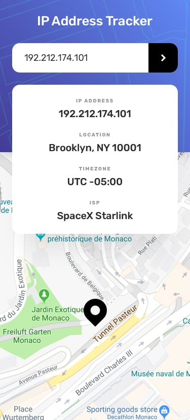

# IP Address Tracker

This is a React application that tracks and displays the location of a given IP address using the IP Geolocation API by IPify and LeafletJS for map rendering.

## Depolyments

This repository is deployed on Netlify here: https://react-ip-address-geolocator.netlify.app/

## Layout Previews




## Getting Started

### Requirements

- Node.js, NPM, and Vite

- An IP Geolocation API key from IPify https://geo.ipify.org/ storeded in an environment variable name VITE_API_KEY

- A web browser for testing

### Install

#### Clone the repo

```
git clone https://github.com/shanosha/mod-11.git
```

#### Navigate into project

```
cd mod-11
```

#### Install dependencies

```
npm install
```

### Usage

#### Add your API key

- Create a file in the root directory called ".env".

- In the file, add the following line of code with your API key:

```javascript
VITE_API_KEY = "YOUR_API_KEY_HERE";
```

#### Run in development mode

```
npm run dev
```

Open the app in your browser at the URL address displayed in your terminal. You can begin using and testing the app.

#### Build for production

```
npm run build
```

This outputs a production bundle to dist/.

## Reflections

In this project I had to take a previous project done in HTML, SCSS, and vanilla JavaScript, and refactor the code for a single page React app. The first thing I did after setting up my development environment was take the HTML from the main section of my previous project, and place it inside my App component. Then I broke don the HTML into separate components that I could use for my project, placing the components in the same position that the HTML had previously been. This enabled me to reuse the SCSS that I’d created on my previous project without having to redo the design.

Once I had the layout, I started working on the functionality. I setup core functionality like controlled form inputs, onChange events, onSubmit events, and since my application did not require me to deeply nest components I used props and callback functions to pass data updates between components. When it came to handling form validations and fetching data, I was able to reuse and refactor some of the code that I’d previously created. I added features one at a time, testing after each edit was made to ensure that the new feature was reacting as expected. Also, during development I used mock data, to avoid reaching the limit on my API key.
